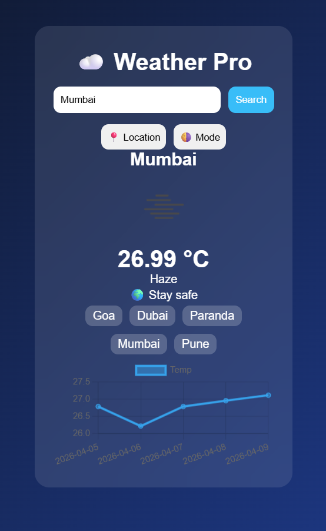
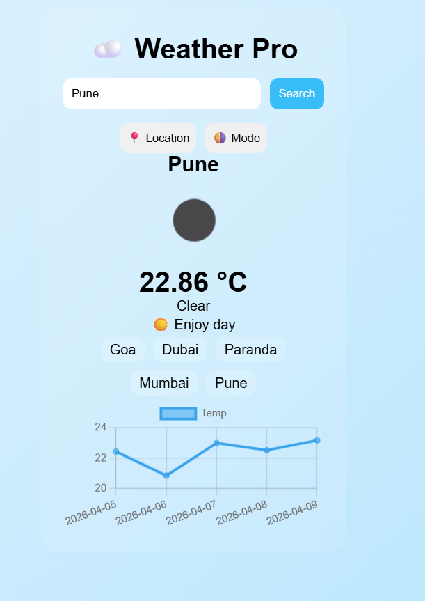
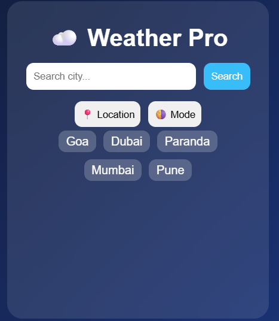

# 🌤 Weather Pro — Full Stack Weather App

## 📸 Screenshots





## 🚀 Live Demo

👉 https://yash-weather-pro.netlify.app

---

## 📌 Features

* 🌤 Real-time weather data (API)
* 📊 5-day forecast with charts
* 📍 Auto location detection
* 📜 Search history (localStorage)
* 🌗 Dark / Light mode
* 💎 Premium glassmorphism UI
* 📱 Fully responsive (mobile friendly)
* 🚀 PWA support (installable app)
* 🤖 Smart weather suggestions

---

## 🛠 Tech Stack

**Frontend:**

* HTML, CSS, JavaScript
* Chart.js

**Backend:**

* Node.js
* Express.js
* OpenWeather API

**Deployment:**

* Frontend → Netlify
* Backend → Render

---

## ⚙️ How It Works

Frontend sends request → Backend processes API → Returns data → UI updates dynamically

---

## 📂 Project Structure

```
weather-app/
│
├── index.html
├── style.css
├── script.js
├── manifest.json
├── service-worker.js
│
└── backend/
    └── server.js
```

---

## 🧠 Learnings

* API integration & async handling
* Full stack architecture
* Deployment (Netlify + Render)
* UI/UX design principles
* State management with localStorage

---

## 💡 Future Improvements

* 🌍 Multi-language support
* 📊 Advanced analytics dashboard
* 🔔 Weather alerts system

---

## 👨‍💻 Author

**Yash Raykar**

---

## ⭐ If you like this project

Give it a ⭐ on GitHub!
